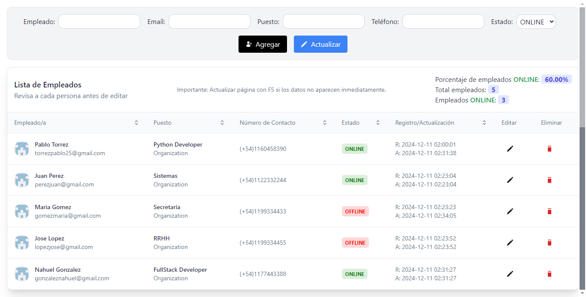

# Sistema de Registros de Trabajadores

Esta es una aplicación de gestión de registros de trabajadores, implementada con **Angular** en el frontend y **PHP** con **MySQL** en el backend. La aplicación permite realizar un CRUD (Crear, Leer, Actualizar y Eliminar) de trabajadores, junto con características adicionales.



## Características

- **CRUD completo de trabajadores**: Crear, leer, actualizar y eliminar registros de trabajadores.

## Requisitos

- **Angular**
- **PHP**
- **MySQL**
- **Composer** (para manejar dependencias de PHP)
- **XAMPP** o cualquier servidor local de PHP con MySQL
- **Bootstrap o Tailwind**, el que prefieras

## Instalación

### 1. Clonar el repositorio

```bash
git clone https://github.com/tu-usuario/app-registros-trabajadores.git
```

### 2. Backend (Si usas Xampp, esta carpeta debe estar dentro de htdocs)
> 1. Ir al proyecto backend: 
```bash
cd backend
```
> 2. Configurar la BD:
```php
$host = "localhost";
$user = "root";
$password = "";
$dbname = "app_registros_trabajadores";
```
> 3. Instalar las dependencias de PHP con Composer:
```bash
composer install
```
> 4. Importar el archivo SQL en tu servidor MySQL para crear la BD y las tablas necesarias (opcional):
```bash
mysql -u root -p app_registros_trabajadores < database.sql
```
> 5. Ejecutar el servidor PHP:
```bash
php -S localhost:8000
```
### 3.  Frontend (Angular)
> 1. Ir al proyecto frontend:
```bash
cd frontend
```
> 2. Instalas las dependencias de Angular:
```bash 
npm install 
```
> 3. Configura la URL del backend en el archivo `usuarios.service.ts`:
```typescript
private URL = "http://localhost:8000";
```
> 4. Levantar el servidor de desarrollo de Angular: `ng serve --open`

## Running unit tests
- Run `ng test` to execute the unit tests via [Karma](https://karma-runner.github.io).
- Dependencias: 
```bash
npm install jasmine-core karma karma-chrome-launcher karma-jasmine karma-jasmine-html-reporter --save-dev
```
- Configuración básica de `karma.conf.js` (manualmente)
```js
module.exports = function (config) {
  config.set({
    basePath: '',
    frameworks: ['jasmine', '@angular-devkit/build-angular'],
    plugins: [
      require('karma-jasmine'),
      require('karma-chrome-launcher'),
      require('karma-jasmine-html-reporter'),
      require('karma-coverage'),
      require('@angular-devkit/build-angular/plugins/karma')
    ],
    client: {
      clearContext: false // Mantener visible la salida de las pruebas
    },
    coverageReporter: {
      dir: require('path').join(__dirname, './coverage'),
      subdir: '.',
      reporters: [{ type: 'html' }, { type: 'text-summary' }]
    },
    reporters: ['progress', 'kjhtml'],
    port: 9876,
    colors: true,
    logLevel: config.LOG_INFO,
    autoWatch: true,
    browsers: ['Chrome'],
    singleRun: false,
    restartOnFileChange: true
  });
};
```
- Crear desde la terminal `karma.conf.js` (debe existir el archivo en la raíz del proyecto)
```bash
ng test --watch=false --karma-config karma.conf.js
```

## Autor: [Pablo Torrez](https://github.com/pblnahu1)